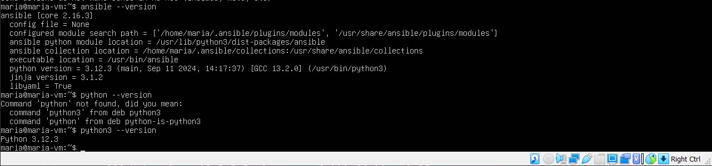
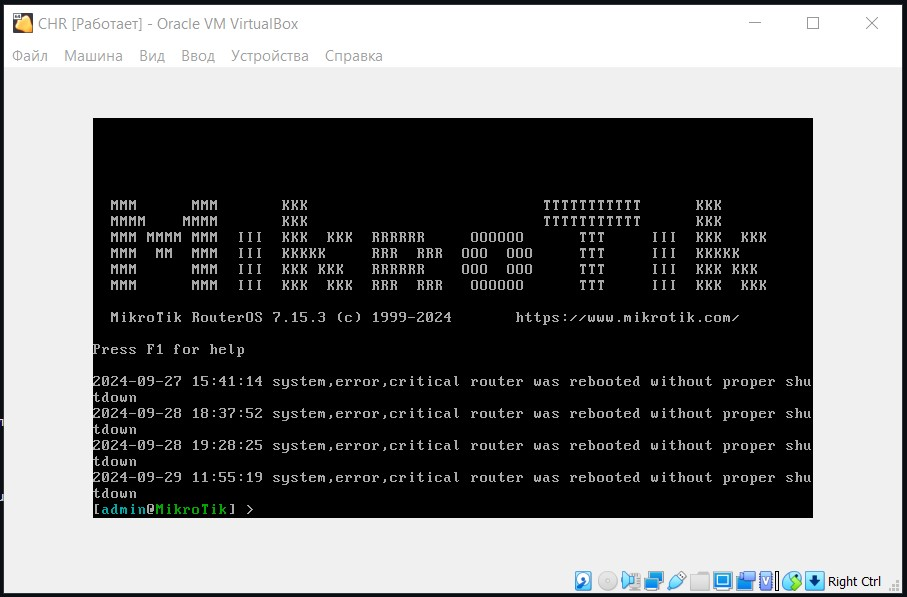
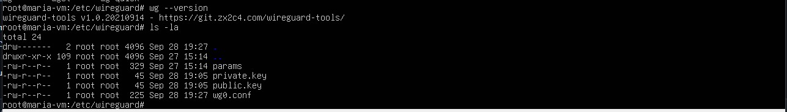
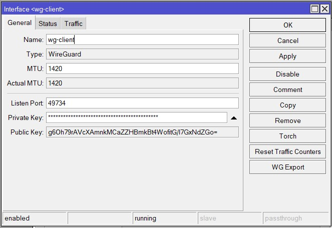
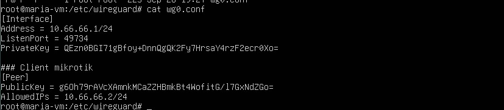
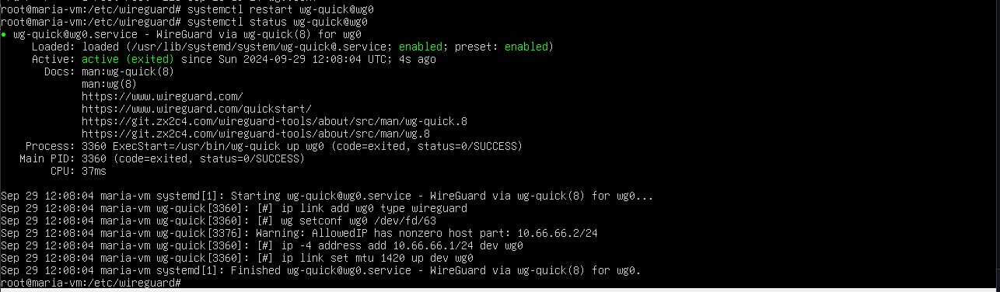
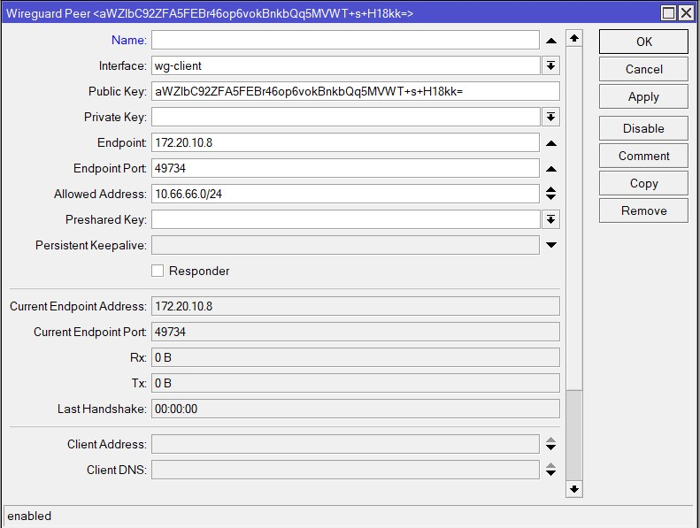
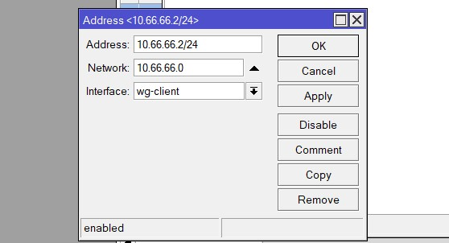
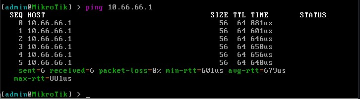
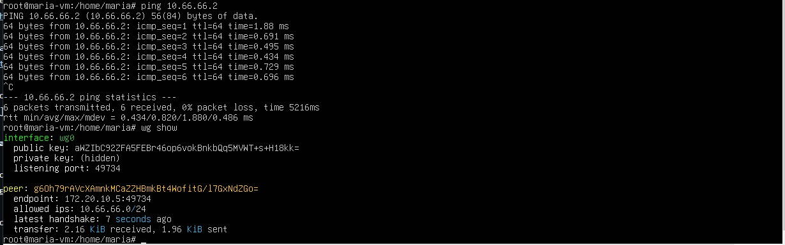

University: [ITMO University](https://itmo.ru/ru/)

Faculty: [FICT](https://fict.itmo.ru)

Course: [Network programming](https://github.com/itmo-ict-faculty/network-programming)

Year: 2024/2025

Group: K34202

Author: Shalyapina Maria Vasilievna

Lab: Lab1

Date of create: 28.09.2024

Date of finished: 29.09.2024

# Лабораторная работа №1 "Установка CHR и Ansible, настройка VPN"

## Описание
Данная работа предусматривает обучение развертыванию виртуальных машин (VM) и системы контроля конфигураций Ansible а также организации собственных VPN серверов.

## Цель работы
Целью данной работы является развертывание виртуальной машины на базе платформы Microsoft Azure с установленной системой контроля конфигураций Ansible и установка CHR в VirtualBox.

## Ход выполнения работы

1. Создание виртуальной машины (была выбрана Ubuntu 22.04), установка python3 и Ansible
 

2. На другой виртуальной машине был установлен CHR

3. На сервере был установлен Wireguard, а также сгенерированы приватный и публичный ключи для сервера

4. Для настройки клиента было выполнено подключение к роутеру через WinBox, создан интерфейс WireGuard

5. На сервере был прописан конфигурационный файл wg0.conf с публичным ключом клиента, полученным на предыдущем шаге

6. Запускаем службу

7. Далее на CHR в разделе WireGuard -> Peers была добавлена информация о VPN-севере

8. Созданному раннее интерфейсу wg-client был присвоен адрес 10.66.66.2 

## Результат

Проверка доступности сервера

Проверка доступности клиента

