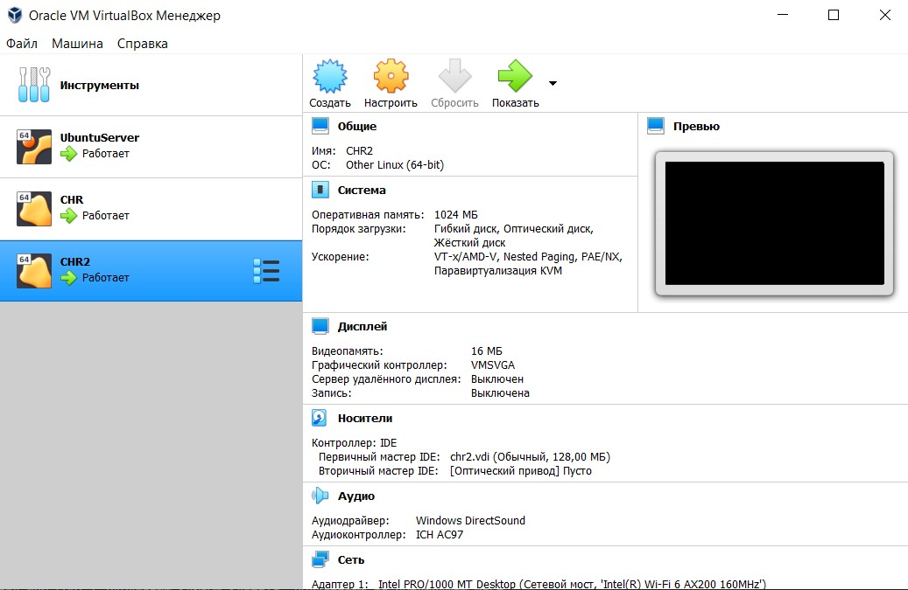
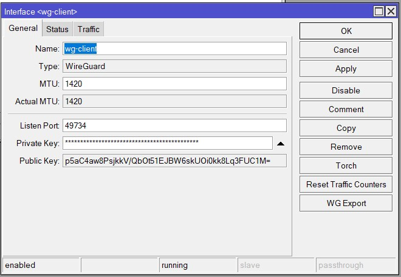
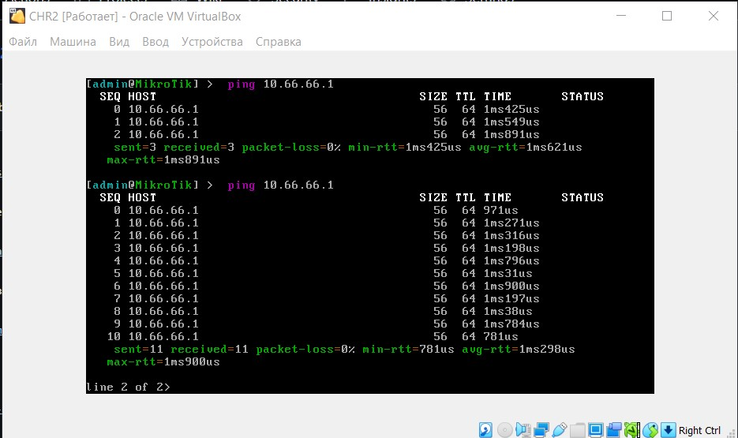
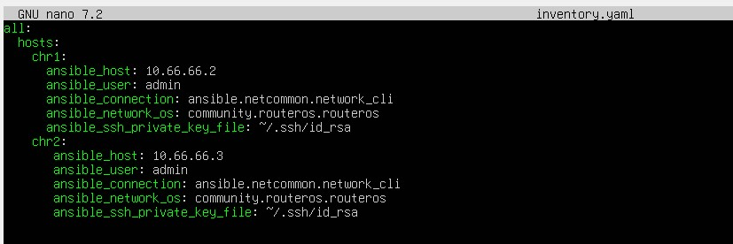
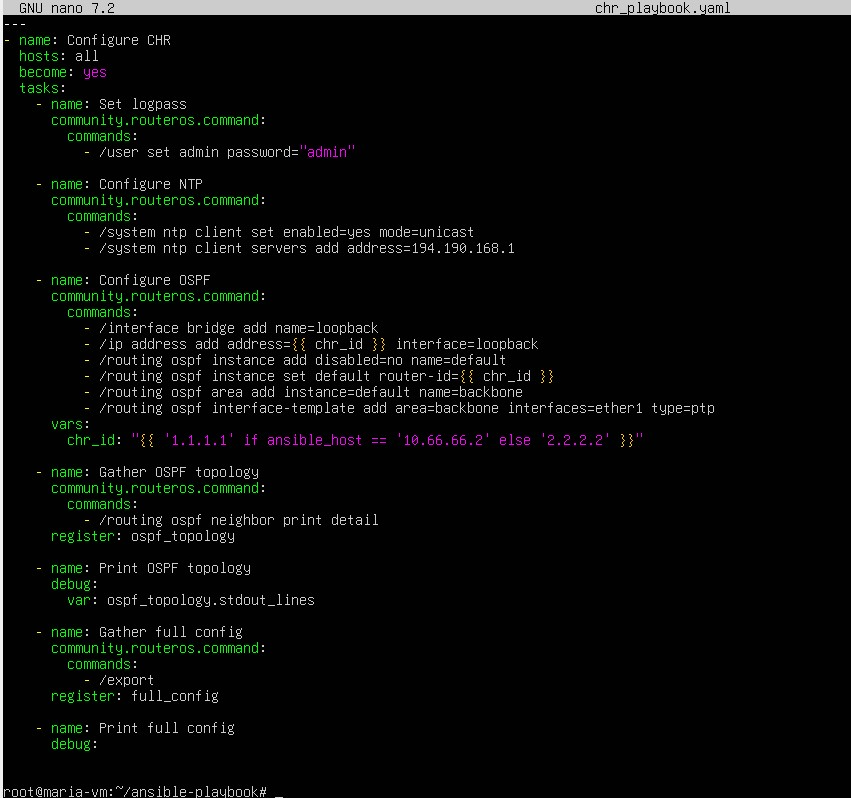
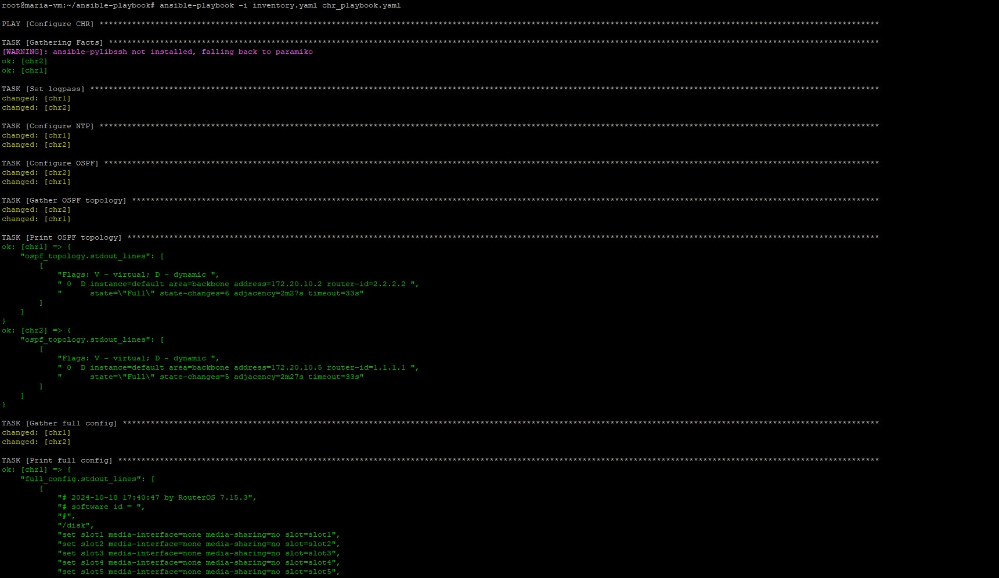

University: [ITMO University](https://itmo.ru/ru/)

Faculty: [FICT](https://fict.itmo.ru)

Course: [Network programming](https://github.com/itmo-ict-faculty/network-programming)

Year: 2024/2025

Group: K34202

Author: Shalyapina Maria Vasilievna

Lab: Lab2

Date of create: 18.10.2024

Date of finished: 18.10.2024

# Лабораторная работа №2 "Развертывание дополнительного CHR, первый сценарий Ansible"

## Цель работы
С помощью Ansible настроить несколько сетевых устройств и собрать информацию о них. Правильно собрать файл Inventory.

## Ход выполнения работы

1. В VirtualBox был создан второй CHR
 


2. На созданном роутере CHR2 был настроен Wireguard интерфейс



3. На сервере в файл wg0.conf была добавлена информация о новом клиенте с адресом 10.66.66.3. Проверка доступности сервера со второго CHR:



4. Был создан файл [inventory.yaml](./assets/inventory.yaml), содержащий информацию об узлах, на которых следует производить настройку



5. Для настройки устройств был создан Ansible плейбук [chr_playbook.yaml](./assets/chr_playbook.yaml), который включает в себя следующие указания:



   - Set logpass: устанавливает пароль "admin" для пользователя admin
   - Configure NTP: включает и настраивает NTP клиента
   - Configure OSPF: настраивает протокол OSPF с указанием Router ID
   - Gather OSPF topology: собирает информацию по OSPF топологии
   - Print OSPF topology: выводит информацию по OSPF топологии
   - Gather full config: собирает все данные о конфигурации устройства
   - Print full config: выводит данные о конфигурации устройства


6. Выполнение плейбука



7. Данные по OSPF топологии

```bash
TASK [Print OSPF topology] ******************************************************************************************************************************************************************
ok: [chr1] => {
    "ospf_topology.stdout_lines": [
        [
            "Flags: V - virtual; D - dynamic ",
            " 0  D instance=default area=backbone address=172.20.10.2 router-id=2.2.2.2 ",
            "      state=\"Full\" state-changes=6 adjacency=2m27s timeout=33s"
        ]
    ]
}
ok: [chr2] => {
    "ospf_topology.stdout_lines": [
        [
            "Flags: V - virtual; D - dynamic ",
            " 0  D instance=default area=backbone address=172.20.10.5 router-id=1.1.1.1 ",
            "      state=\"Full\" state-changes=5 adjacency=2m27s timeout=33s"
        ]
    ]
}
```

8. Полный конфиг устройств

```bash
TASK [Print full config] ********************************************************************************************************************************************************************
ok: [chr1] => {
    "full_config.stdout_lines": [
        [
            "# 2024-10-18 17:40:47 by RouterOS 7.15.3",
            "# software id = ",
            "#",
            "/disk",
            "set slot1 media-interface=none media-sharing=no slot=slot1",
            "set slot2 media-interface=none media-sharing=no slot=slot2",
            "set slot3 media-interface=none media-sharing=no slot=slot3",
            "set slot4 media-interface=none media-sharing=no slot=slot4",
            "set slot5 media-interface=none media-sharing=no slot=slot5",
            "set slot6 media-interface=none media-sharing=no slot=slot6",
            "set slot7 media-interface=none media-sharing=no slot=slot7",
            "set slot8 media-interface=none media-sharing=no slot=slot8",
            "set slot9 media-interface=none media-sharing=no slot=slot9",
            "/interface bridge",
            "add name=loopback",
            "/interface wireguard",
            "add listen-port=49734 mtu=1420 name=wg-client",
            "/routing ospf instance",
            "add disabled=no name=default router-id=1.1.1.1",
            "/routing ospf area",
            "add disabled=no instance=default name=backbone",
            "/interface wireguard peers",
            "add allowed-address=10.66.66.0/24 endpoint-address=172.20.10.8 endpoint-port=\\",
            "    49734 interface=wg-client name=peer1 public-key=\\",
            "    \"aWZIbC92ZFA5FEBr46op6vokBnkbQq5MVWT+s+H18kk=\"",
            "/ip address",
            "add address=10.66.66.2/24 interface=wg-client network=10.66.66.0",
            "add address=1.1.1.1 interface=loopback network=1.1.1.1",
            "/ip dhcp-client",
            "add interface=ether1",
            "/ip firewall filter",
            "add action=accept chain=input dst-port=49734 protocol=udp src-address=\\",
            "    172.20.10.5",
            "/ip route",
            "add disabled=no distance=1 dst-address=10.66.66.1/32 gateway=wg-client \\",
            "    routing-table=main scope=30 suppress-hw-offload=no target-scope=10",
            "/routing ospf interface-template",
            "add area=backbone disabled=no interfaces=ether1 type=ptp",
            "add area=backbone disabled=no interfaces=ether1 type=ptp",
            "/system note",
            "set show-at-login=no",
            "/system ntp client",
            "set enabled=yes",
            "/system ntp client servers",
            "add address=194.190.168.1"
        ]
    ]
}
ok: [chr2] => {
    "full_config.stdout_lines": [
        [
            "# 2024-10-18 17:40:47 by RouterOS 7.16.1",
            "# software id = ",
            "#",
            "/interface bridge",
            "add name=loopback",
            "/interface wireguard",
            "add listen-port=49734 mtu=1420 name=wg-client",
            "/routing ospf instance",
            "add disabled=no name=default router-id=2.2.2.2",
            "/routing ospf area",
            "add disabled=no instance=default name=backbone",
            "/interface wireguard peers",
            "add allowed-address=10.66.66.0/24 endpoint-address=172.20.10.8 endpoint-port=\\",
            "    49734 interface=wg-client name=peer1 public-key=\\",
            "    \"aWZIbC92ZFA5FEBr46op6vokBnkbQq5MVWT+s+H18kk=\"",
            "/ip address",
            "add address=10.66.66.3/24 interface=wg-client network=10.66.66.0",
            "add address=2.2.2.2 interface=loopback network=2.2.2.2",
            "/ip dhcp-client",
            "add interface=ether1",
            "/ip route",
            "add disabled=no dst-address=10.66.66.1/32 gateway=wg-client routing-table=\\",
            "    main suppress-hw-offload=no",
            "/routing ospf interface-template",
            "add area=backbone disabled=no interfaces=ether1 type=ptp",
            "add area=backbone disabled=no interfaces=ether1 type=ptp",
            "/system note",
            "set show-at-login=no",
            "/system ntp client",
            "set enabled=yes",
            "/system ntp client servers",
            "add address=194.190.168.1"
        ]
    ]
}

```
## Схема связи


