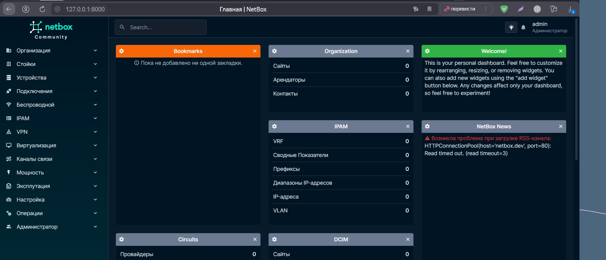
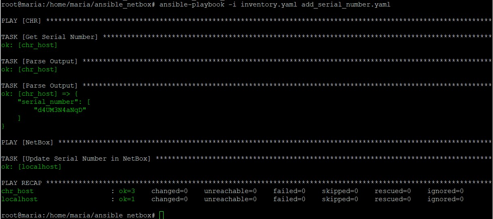

University: [ITMO University](https://itmo.ru/ru/)

Faculty: [FICT](https://fict.itmo.ru)

Course: [Network programming](https://github.com/itmo-ict-faculty/network-programming)

Year: 2024/2025

Group: K34202

Author: Shalyapina Maria Vasilievna

Lab: Lab2

Date of create: 21.11.2024

Date of finished: 22.11.2024

# Лабораторная работа №3 "Развертывание Netbox, сеть связи как источник правды в системе технического учета Netbox"

## Цель работы
С помощью Ansible и Netbox собрать всю возможную информацию об устройствах и сохранить их в отдельном файле.

## Ход выполнения работы

### Установка NetBox
PostgreSQL нужен для работы NetBox как основная реляционная база данных. Он используется для хранения всей структурированной информации


Redis в NetBox выполняет три ключевые функции: кэширование данных, асинхронная обработка задач и управление пользовательскими сессиями


Клонируем репозиторий NetBox


Создаем виртуальное окружение, устанавливаем необходимые зависимости и настраиваем конфигурационный файл configuration.py (копируем содержимое файла configuration_example.py), генерируем секретный ключ.

```bash
python3 -m venv venv
source venv/bin/activate
```
```bash
pip install -r requirements.txt
```
```bash
python3 generate_secret_key.py
```

Инициализируем базу данных и создаем суперпользователя
```bash
python3 manage.py migrate
python3 manage.py createsuperuser
```
Устанавливаем Gunicorn - это WSGI-сервер, который запускает Python-приложение NetBox и обрабатывает запросы, и Nginx - веб-сервер, который используется как обратный прокси для Gunicorn.
После этого запускам netbox и nginx


Пробрасываем нужные порты в VirtualBox, открываем браузер и переходим по ссылке https://localhost:8000



### Добавление информации об устройствах

Во вкладке "Устройства" была внесена информация о двух роутерах R1 и R2 (роль, производитель, тип, IP-адрес)


### Сохранение данных из NetBox в файл

Файл inventory.yaml:
```yaml
all:
  hosts:
    localhost:
      ansible_connection: local
```
Роль fetch_info (roles/fetch_info/tasks/main.yaml) для сбора данных и сохранения их в файл:
```yaml
---
- name: NetBox Connect
  uri:
    url: "{{ netbox_url }}/api/dcim/devices/"
    headers:
      Authorization: "Token {{ netbox_token }}"
    validate_certs: false
    return_content: true
  register: netbox_response

- name: Export Data
  copy:
    content: "{{ netbox_response.json | to_nice_json }}"
    dest: "{{ output_file }}"

```

Ansible плейбук playbook.yaml:
```yaml
---
- name: Gather devices info
  hosts: localhost
  gather_facts: false
  vars:
    netbox_url: "https://10.0.2.15:443"
    netbox_token: "b0e1baf3819699b9f81b68096e13a811377f8f7a"
    output_file: "netbox_devices.json"
  roles:
    - fetch_info
```

Запускаем выполнение плейбука командой
```bash
ansible-playbook -i inventory.yaml playbook.yaml
```


Получили файл [netbox_devices.json](./result/netbox_devices.json), содержащий собранную информацию об устройствах

### Изменение имени устройства и добавление IP-адреса

Файл inventory.yaml:
```yaml
all:
  hosts:
    localhost:
      ansible_connection: local
    chr_host:
      ansible_host: 192.168.56.107
      ansible_user: admin
      ansible_connection: ansible.netcommon.network_cli
      ansible_network_os: community.routeros.routeros
      ansible_ssh_private_key_file: /root/.ssh/id_rsa
```
[Плейбук](./result/configure_chr.yaml) для изменения настроек роутера в соответствии с данными из NetBox:

<details>
<summary>Показать код</summary>
  
```yaml
---
- name: Fetch Info from NetBox
  hosts: localhost
  gather_facts: false
  vars:
   netbox_url: "https://10.0.2.15:443"
   netbox_token: "b0e1baf3819699b9f81b68096e13a811377f8f7a"

  tasks:
    - name: Fetch Info
      uri:
        url: "{{ netbox_url }}/api/dcim/devices"
        headers:
          Authorization: "Token {{ netbox_token }}"
        method: GET
        return_content: yes
        validate_certs: false
      register: device_data

    - name: Export Name and IP Address
      set_fact:
        device_name: "{{ device_data.json.results[1].name }}"
        netbox_ip_address: "{{ device_data.json.results[1].primary_ip.address }}"

- name: Configure CHR
  hosts: chr_host
  gather_facts: false

  tasks:
    - name: Change Name
      community.routeros.command:
        commands:
          - /system identity set name={{ hostvars['localhost'].device_name }}

    - name: Add IP address
      community.routeros.command:
        commands:
          - /ip address add address={{ hostvars['localhost'].netbox_ip_address }} interface=netbox disabled=no
```
</details>

После выполнения плейбука, проверяем изменения на роутере:

Изменение имени устройства с MikroTik на R2


Добавление IP-адреса 192.168.0.105/24


### Добавление серийного номера в NetBox

Сперва собираем информацию о серийном номере устройства командой ```bash /system license print ```. Затем выполняем PATCH-запрос, чтобы обновить серийный номер устройства в Netbox.

[Плейбук](./result/add_serial_number.yaml) для добавления серийного номера в NetBox:

<details>
<summary>Показать код</summary>
  
```yaml
---
- name: CHR
  hosts: chr_host
  gather_facts: false

  tasks:
    - name: Get Serial Number
      community.routeros.command:
        commands:
          - /system license print
      register: serial_output

    - name: Parse Output
      set_fact:
        serial_number: "{{ serial_output.stdout_lines[0][0] | regex_search('system-id: (\\S+)','\\1') }}"

    - name: Parse Output
      debug:
        var: serial_number


- name: NetBox
  hosts: localhost
  gather_facts: false
  vars:
   netbox_url: "https://10.0.2.15:443"
   netbox_token: "b0e1baf3819699b9f81b68096e13a811377f8f7a"

  tasks:
    - name: Update Serial Number in NetBox
      uri:
        url: "{{ netbox_url }}/api/dcim/devices/2/"
        method: PATCH
        headers:
          Authorization: "Token {{ netbox_token }}"
          Content-Type: "application/json"
        body:
          serial: "{{ hostvars['chr_host'].serial_number[0] | string }}"
        body_format: json
        validate_certs: no
      register: update_response
```

</details>

Успешное выполнение плейбука:




Обновленный серийный номер в NetBox:


