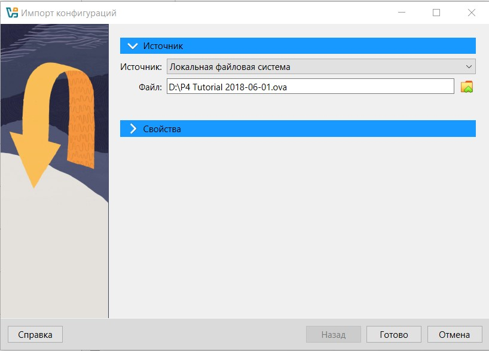
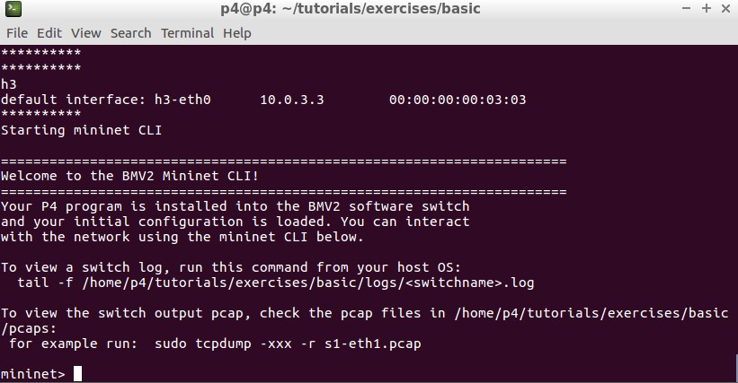
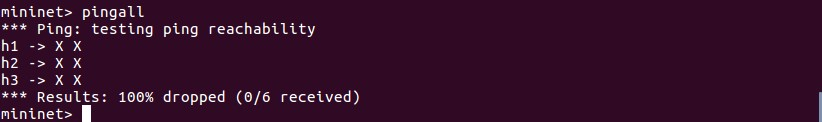
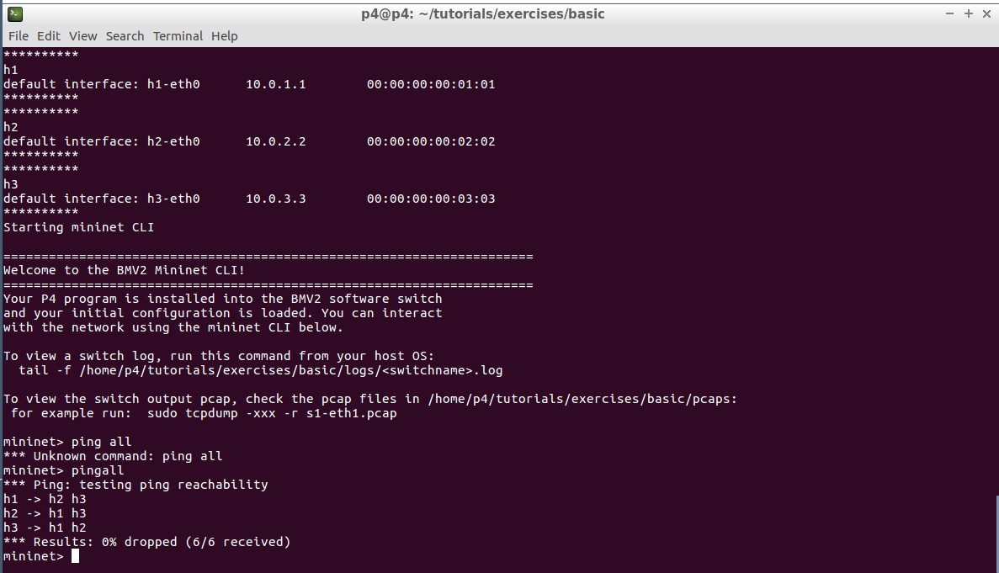
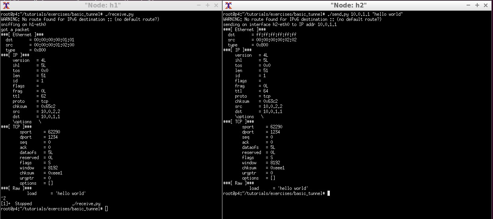
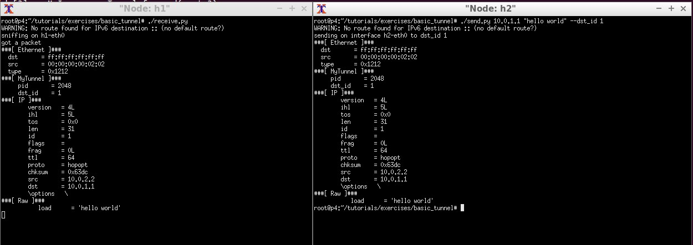
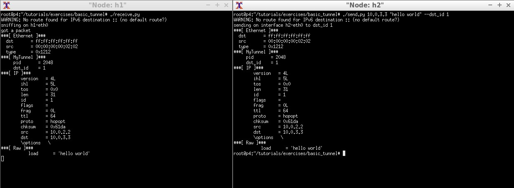

University: [ITMO University](https://itmo.ru/ru/)

Faculty: [FICT](https://fict.itmo.ru)

Course: [Network programming](https://github.com/itmo-ict-faculty/network-programming)

Year: 2024/2025

Group: K34202

Author: Shalyapina Maria Vasilievna

Lab: Lab4

Date of create: 09.01.2025

Date of finished: 09.01.2025

# Лабораторная работа №4 "Базовая 'коммутация' и туннелирование используя язык программирования P4"

## Цель работы
Изучить синтаксис языка программирования P4 и выполнить 2 задания обучающих задания от Open network foundation для ознакомления на практике с P4.

## Ход работы
Был скачан образ виртуальной машины P4 Tutorial, далее образ был импортирован через импорт конфигураций в VirtualBox



### Реализация базовой переадресации
1. В полученной виртуальной машине после перехода в директорию ```tutorials/exercices/basic``` была выполнена команда ```make run``` для поднятия Mininet



2. Выполнение команды ```pingall``` демонстрирует, что коммутаторы отбрасывают все входящие пакеты



3. Чтобы это исправить, нужно внести изменения в файл конфигурации basic.p4

  * Добавим логику парсинга для пакетов ethernet и ipv4:

```c
/*************************************************************************
*********************** P A R S E R  ***********************************
*************************************************************************/

parser MyParser(packet_in packet,
                out headers hdr,
                inout metadata meta,
                inout standard_metadata_t standard_metadata) {

    state start {
        transition parse_ethernet;
    }

    state parse_ethernet {
        packet.extract(hdr.ethernet);
        transition select(hdr.ethernet.etherType) {
            TYPE_IPV4 : parse_ipv4;
            default : accept;
        }
    }

    state parse_ipv4 {
        packet.extract(hdr.ipv4);
        transition accept;
    }
}
```

  * В разделе INGRESS PROCESSING нужно дополнить логику пересылки пакетов для действия ```ipv4_forward```, а также добавить проверку на валидность IPv4 заголовков

```c
/*************************************************************************
**************  I N G R E S S   P R O C E S S I N G   *******************
*************************************************************************/
...

action ipv4_forward(macAddr_t dstAddr, egressSpec_t port) {
        standard_metadata.egress_spec = port;
        hdr.ethernet.srcAddr = hdr.ethernet.dstAddr;
        hdr.ethernet.dstAddr = dstAddr;
        hdr.ipv4.ttl = hdr.ipv4.ttl - 1;
    }

...

 apply {
        if (hdr.ipv4.isValid()) {
            ipv4_lpm.apply();
        }
    }

...
```

  * В секции DEPARSER добавить функцию для вставки заголовков в исходящие пакеты

```c
/*************************************************************************
***********************  D E P A R S E R  *******************************
*************************************************************************/

control MyDeparser(packet_out packet, in headers hdr) {
    apply {
        packet.emit(hdr.ethernet);
        packet.emit(hdr.ipv4);
    }
}
```

4. Успешное выполнение команды ```pingall``` после сохранения всех изменений в файле и повторного запуска Mininet:



### Реализация базового туннелирования
1. Для реализации базового туннелирования нужно перейти в директорию ```tutorials/exercices/basic_tunnel/``` и внести изменения в файл ```basic_tunnel.p4```. Некоторые изменения были уже внесены, например, был добавлен заголовок myTunnel_t, содержащий в себе id протокола и источника
```c
...

header myTunnel_t {
    bit<16> proto_id;
    bit<16> dst_id;
}
...
```

2. Дополнить файл нужно следующим образом:

  * В секции PARSER требуется описать логику обработки заголовков myTunnel

```c
/*************************************************************************
*********************** P A R S E R  ***********************************
*************************************************************************/
...

state parse_myTunnel {
        packet.extract(hdr.myTunnel);
        transition select(hdr.myTunnel.proto_id) {
            TYPE_IPV4 : parse_ipv4;
            default : accept;    
        }
    }
...
```

  * В секции INGRESS PROCESSING нужно объявить новое действие myTunnel_forward и новую таблицу myTunnel_exact, а также добавить применение таблицы в секции apply

```c
/*************************************************************************
**************  I N G R E S S   P R O C E S S I N G   *******************
*************************************************************************/
...

 action myTunnel_forward(egressSpec_t port) {
        standard_metadata.egress_spec = port;
    }

    table myTunnel_exact {
        key = {
            hdr.myTunnel.dst_id: exact;
        }
        actions = {
            myTunnel_forward;
            drop;
            NoAction;
        }
        size = 1024;
        default_action = NoAction();
    }

    apply {
        if (hdr.ipv4.isValid() && !hdr.myTunnel.isValid()) {
            ipv4_lpm.apply();
        }
        if (hdr.myTunnel.isValid()) {
            myTunnel_exact.apply();
        }
    }
...
```

  * В секции DEPARSER также нужно добавить логику обработки для исходящих пакетов туннелирования
```c
/*************************************************************************
***********************  D E P A R S E R  *******************************
*************************************************************************/

control MyDeparser(packet_out packet, in headers hdr) {
    apply {
        packet.emit(hdr.ethernet);
        packet.emit(hdr.myTunnel);
        packet.emit(hdr.ipv4);
    }
}
``` 

3. Проверка корректности работы повторно поднятого Mininet:

* В терминале коммутатора H1 был запущен сервер ```./receive.py```, после чего в терминале H2 была выполнена команда ```./send.py 10.0.1.1 "hello world"```. Отправка сообщения без туннелирования прошла успешно



* Для проверки работы туннелирования на H2 была выполнена команда ```./send.py 10.0.1.1 "hello world" --dst_ip 1```. У полученного пакета есть заголовок MyTunnel



* При выполнении команды  ```./send.py 10.0.3.3 "hello world" --dst_ip 1``` сообщение будет получено первым коммутатором, несмотря на то, что указан IP-адрес третьего. Это объясняется тем, что при наличии заголовка MyTunnel в пакете именно он используется для маршрутизации, а не IP-заголовок



## Результат

Получены файлы [basic.p4](./assets/basic.p4) и [basic_tunnel.p4](./assets/basic_tunnel.p4)


